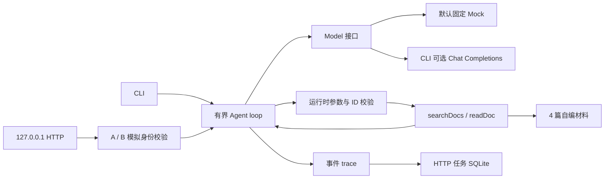
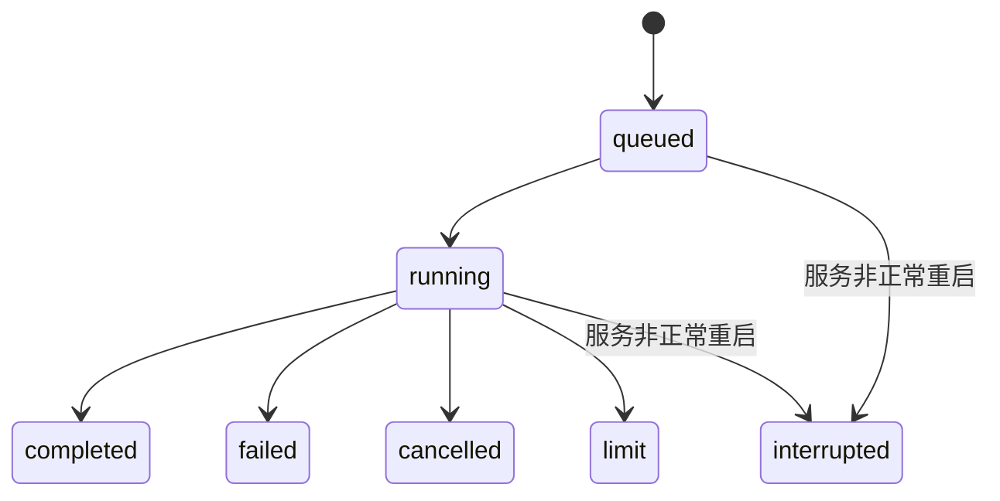

# 架构与状态

模型返回 `ToolCall` 是请求；应用检查名称、调用 ID、参数和预算，才执行。工具响应原样带回调用 ID。工具错误是可读取的信息，外层预算确保错误循环会停止。

`interrupted` 只记录上次没有完成，不代表已经恢复。接下来若要恢复执行，需要明确保存会话检查点、工具执行状态与幂等性。当前只读工具的风险较低；未来加“保存草稿”等写工具，应先设计审批和幂等键。

`TaskStore.get` 的 SQL 同时检查 `id` 和 `owner`。这验证的是数据访问条件。HTTP 头可以伪造，因此没有认证过的真实用户身份。

总时间预算使用 `performance.now()` 单调时间，可中断等待模型，并在模型返回、工具执行前后等边界检查。单次同步模型、工具或 trace 回调无法在同一 JS 线程中被抢占，超出预算后会在返回边界被判为 `limit`；当前两个工具只扫描固定小语料。以后执行 CPU 密集或外部 I/O 工具，应使用可取消 I/O / worker 并传递 deadline。

trace 会记录模型文本与工具参数；本版本只使用教学资料。接入个人材料前，需自行设计脱敏、保留期限与日志访问控制。
