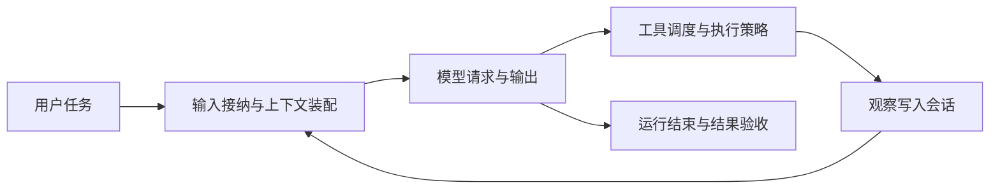

# DSH / Codex：沿完整任务读 Harness

核验日期：2026-10-05。今天用“读取指定教学资料，给出三条有依据的结论，并指出资料未说明的事项”追踪整个系统。先看信息怎样流动，再在独立学习项目里实现或验证一个模块。

## 固定阅读版本

- DSH 官方上游：`5badb15009ae1756c3afe0ae0cef1faafc290ccc`，见 [仓库](https://github.com/deepseek-ai/deepseek-harness/tree/5badb15009ae1756c3afe0ae0cef1faafc290ccc)。固定提交避免教程行号随更新变化；不同定制版本应重新定位函数。
- Codex 开源 CLI/core：`315f0efb34880e44b642208b4b2cb289760c7ca1`，见 [仓库](https://github.com/openai/codex/tree/315f0efb34880e44b642208b4b2cb289760c7ca1)。本导读只讨论这部分源码。

模型根据给定上下文提出回答或行动；Harness 负责装配请求、接入工具、执行策略、记录观察与推进任务。业务结果的验收仍需应用定义。

这是正常路径的简化图。取消、失败、输入变化和上下文整理会影响运行；不是已执行的模型轨迹。

## DSH 阅读顺序

| 顺序 | 源码入口 | 跟踪的数据 |
| --- | --- | --- |
| 1 | [preStep](https://github.com/deepseek-ai/deepseek-harness/blob/5badb15009ae1756c3afe0ae0cef1faafc290ccc/packages/core/agent-loop/src/agent.ts#L267) | 输入如何接纳，系统指令与工具如何装配 |
| 2 | [step](https://github.com/deepseek-ai/deepseek-harness/blob/5badb15009ae1756c3afe0ae0cef1faafc290ccc/packages/core/agent-loop/src/agent.ts#L398) | 消息记录、请求构造、模型流与后续工具处理 |
| 3 | [executeToolCalls](https://github.com/deepseek-ai/deepseek-harness/blob/5badb15009ae1756c3afe0ae0cef1faafc290ccc/packages/core/agent-loop/src/tool-calls.ts#L60) | 模型工具请求怎样调度，结果怎样关联原调用 |
| 4 | [tools.execute](https://github.com/deepseek-ai/deepseek-harness/blob/5badb15009ae1756c3afe0ae0cef1faafc290ccc/packages/core/tools/src/index.ts#L1369) | 策略检查、实际实现与结果处理 |
| 5 | [deriveMessages](https://github.com/deepseek-ai/deepseek-harness/blob/5badb15009ae1756c3afe0ae0cef1faafc290ccc/packages/core/session/src/index.ts#L856) | 日志怎样变成模型消息 |
| 6 | [请求中的历史](https://github.com/deepseek-ai/deepseek-harness/blob/5badb15009ae1756c3afe0ae0cef1faafc290ccc/packages/core/agent-loop/src/agent.ts#L671) | 观察怎样进入下一次请求 |

导师沿一个任务解释模块间的连接，学习者在流程图上标注位置。第一遍暂缓并发池和插件注册细节。

## Codex 对照三个职责

- [run_turn](https://github.com/openai/codex/blob/315f0efb34880e44b642208b4b2cb289760c7ca1/codex-rs/core/src/session/turn.rs#L163)：请求与运行推进。
- [handle_output_item_done](https://github.com/openai/codex/blob/315f0efb34880e44b642208b4b2cb289760c7ca1/codex-rs/core/src/stream_events_utils.rs#L315) 与 [tools/router](https://github.com/openai/codex/blob/315f0efb34880e44b642208b4b2cb289760c7ca1/codex-rs/core/src/tools/router.rs#L248)：识别工具请求并交给执行层。
- [工具结果写回](https://github.com/openai/codex/blob/315f0efb34880e44b642208b4b2cb289760c7ca1/codex-rs/core/src/session/turn.rs#L2487)：将工具观察带入后续请求。

不要求为了这次对照学习完整 Rust；用相同系统职责理解不同实现。

## 观察无限尝试与完成判断

DSH 的 [repeat-tool-reminder](https://github.com/deepseek-ai/deepseek-harness/blob/5badb15009ae1756c3afe0ae0cef1faafc290ccc/packages/guard/repeat-tool-reminder/README.md#L168) 只检测工具和参数完全相同的重复。它提供提醒，未实现硬阻断；修改参数可以避开这类检测，最高提醒阈值后也不会持续提醒。

在学习项目中可以比较三种机制：重复提醒、总任务预算、基于新证据判断是否有进展。用同参数重复、换参数却无新证据、正常补资料三个案例验证选择，练习尚未自动实现。

同样需要检查结束后的报告：每条结论能否定位到工具实际返回的依据？资料缺失是否保留为未知？运行 `completed` 只表示执行层终态，具体任务的验收要单独记录。

## 第一份学习证据

留下带源码位置的流程图、一份标明模式的运行记录或源码推演，以及自己的实现取舍说明。运行记录只保存可观察事件，不要求模型隐藏推理。当前学习仓库默认 Mock 为固定脚本；其日志可帮助观察接口与控制流，真实模型效果需另外运行并记录。

今天的安排见 [第一课](lesson-01.md)，后续模块见 [十周路线](roadmap.md)。
